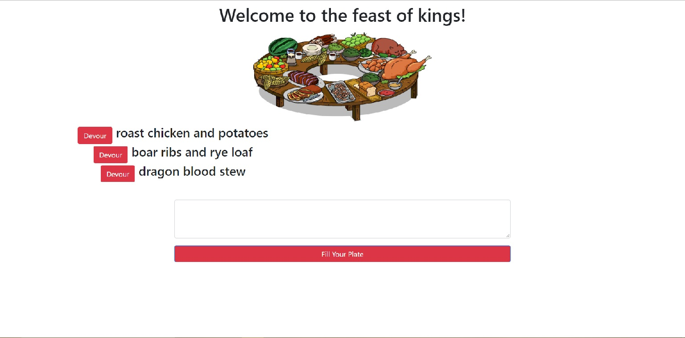
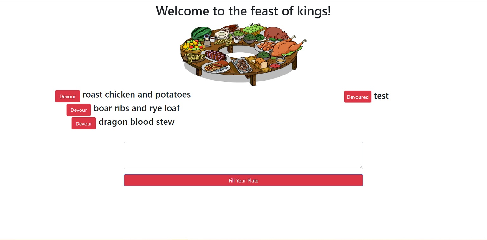

# feast

## Description

A simple full-stack app which allows the user to create and update persistent "feast" entries, and was developed to practice and demonstrate my skills with an emphasis on node.js, Express.js, MySQL, and object relational mapping (ORM).

## Walkthrough

Upon first opening the app, you will see a few feasts on the left side of the page that have already been created.

Create a new feast by typing it in the text area and then clicking "Fill Your Plate". This will add it to the left side of the page and make it available to "Devour".

Click "Devour" beside any of the feasts listed on the left side of the page to move it to the right side of the page and update it as "Devoured".

## Contribution and Help

Morrowii is the sole person maintaining and contributing to this project.

If you need help with anything related to this project, drop me a line on GitHub.